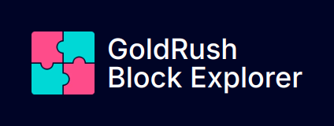

<div align="center">
  <a href="https://goldrush.dev/products/goldrush/"  target="_blank" rel="noopener noreferrer">
    
  </a>
  <br />

[](https://github.com/covalenthq/goldrush-block-explorer-ui/blob/main/LICENSE)
[](https://github.com/covalenthq/goldrush-block-explorer-ui/commits/master)
[](https://github.com/covalenthq/goldrush-block-explorer-ui/graphs/contributors)
[](https://github.com/covalenthq/goldrush-block-explorer-ui/issues)
[](https://github.com/covalenthq/goldrush-block-explorer-ui/pulls)
[](https://github.com/covalenthq/goldrush-block-explorer-ui/stargazers)
[](https://github.com/covalenthq/goldrush-block-explorer-ui/network/members)
<!-- Additional sections of your README -->

</div>

<br/>

<h1 align="center">Beautifully designed Block Explorer template.</h1>

<div align="center">
Powered by <span><a href="https://github.com/covalenthq/goldrush-kit">GoldRush Kit.</a></span> Open-source. Customizable. 200+ Chains.
</div>

## Ready-to-use customizable template

<a href="https://goldrush-block-explorer.vercel.app/">View live template</a>

## 1. Creating your own GoldRush Block Explorer

The GoldRush Block Explorer is a Template Repository. It can be cloned and modified as per different specific use cases.

1.  **Fork Repository**: To create a new deployment of the **GoldRush Block Explorer**, it needs to be forked. This can be done either by clicking the `Use this template` at the top of the repository or clicking [this](https://github.com/new?owner=covalenthq&template_name=goldrush-block-explorer&template_owner=covalenthq)

2.  **Setting the GoldRush API Key**: The **GoldRush Block Explorer** uses the **GoldRush API Key** to function as expected. You can register for a free key on [GoldRush's website](https://goldrush.dev/platform/apikey). The API key needs to be placed in the [.env.local](./env.local) file, which needs to be created. Refer to [.env.example](./.env.example) for the a list of all the environmental variables used.

    > Only the `NEXT_PUBLIC_GOLDRUSH_API_KEY` environmental key is mandatory.

3.  **Deployment**: Once forked, a use specific can be created. The **GoldRush Block Explorer** is powered on the frontend completely using NextJS. Natively, the it is deployed on [Vercel](https://vercel.com/), however any other deployment or server hosting tools such as Netlify, AWS, DigitalOcean can be used.

## 3. Customizing the Deployment

The forked deployment can be customized for every deployment using the [GoldRush Config File](./goldrush.config.ts). The config file exports TypeScript powered const `goldrushConfig`. By default the config file will look like this

```ts
import { type GoldRushConfig } from "./utils/types/shared.types";

export const goldrushConfig: GoldRushConfig = {
    brand: {
        title: "GoldRush",
        subtitle: "Block Explorer",
        logo_url: "/goldrush-logo.png",
    },
    theme: {
        borderRadius: 8,
        colors: {
            dark: {
                primary: "#FF4C8B",
                background: "#000426",
                foreground: "#FFFFFF",
                secondary: "#868E96",
            },
            light: {
                primary: "#00D8D5",
                background: "#FFFFFF",
                foreground: "#1C2024",
                secondary: "#868E96",
            },
        },
        mode: "dark",
    },
    chains: [],
    gtag_id: process.env.NEXT_PUBLIC_GOOGLE_TAG_ID || null,
};
```

1. **brand**: This is the customization of the `nav` bar that is rendered at the top of every page. It looks this by default

    

    1. **title**: It is the first line of your brand. By default, it is set as `GoldRush`.
    2. **subtitle**: It is the second line of your brand. By default, it is set as `Block Explorer`.
    3. **logo_url**: It is the logo of your brand. By default, it is renders the GoldRush Logo. An image src of 40x40px is recommended for this.

2. **theme**: This is an extension of the theme config passed to the [GoldRush Kit](https://github.com/covalenthq/goldrush-kit). Explore these theme settings from [here](https://goldrush-kit.vercel.app/?path=/story/theme-config--theme-config).

3. **chains**: A selection of all the chain the deployment offers. The desired chains can be passed to this array in multiple formats as shown the example below. By default, an empty array (`[]`) is passed here to provide the options all the 200+ chains supported by the [GoldRush API](https://goldrush.dev/docs/networks/). As a default behavior, the home page is rendered based using the first chain thats passed in this array.

    ```ts
    import { ChainID, ChainName } from "@covalenthq/client-sdk";

    chains: [
        "eth-mainnet",
        137,
        ChainID.BSC_MAINNET,
        ChainName.OPTIMISM_MAINNET,
    ];
    ```

4. **gtag_id**: This is the tag ID provided by [Google Analytics](https://developers.google.com/analytics) for realtime tracking of active users on the deployment. By default, it is `null` and is not mandatory to pass. The Google tag looks like `G-**********`.

## GoldRush Repositories

| Name                                                                             | Description                                                                     |
| -------------------------------------------------------------------------------- | ------------------------------------------------------------------------------- |
| [TypeScript SDK](https://github.com/covalenthq/covalent-api-sdk-ts)              | The fastest way to integrate the GoldRush API for working with blockchain data. |
| [GoldRush Kit](https://github.com/covalenthq/goldrush-kit)                       | Beautifully designed React components for your dApp frontend.                   |
| [GoldRush Block Explorer](https://github.com/covalenthq/goldrush-block-explorer) | A cross chain block explorer kit that can be customized.                        |
| [GoldRush Decoder](https://github.com/covalenthq/goldrush-decoder)               | Decode unstructured, raw event logs into structured data with a simple API.     |

## Contributing

Contributions, issues and feature requests are welcome!
Feel free to check [issues](https://github.com/covalenthq/goldrush-revokehub/issues) page.

## Show your support

Give a ⭐️ if this project helped you!

## License

This project is [APACHE](./LICENSE) licensed.
